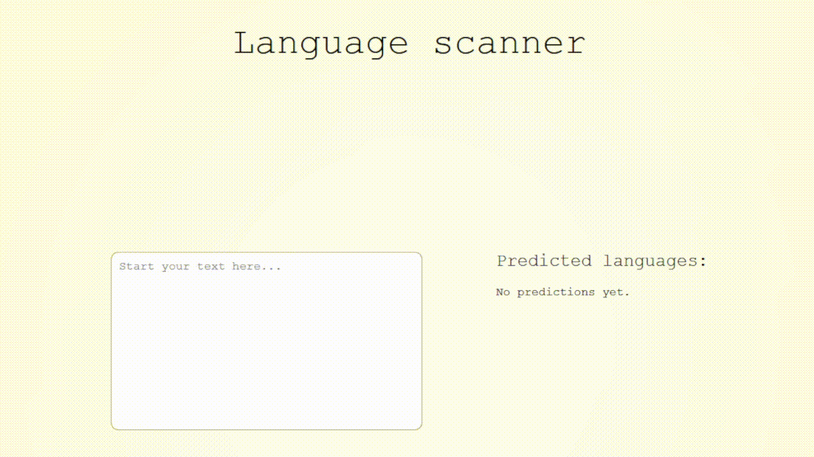

# Language Scanner

Welcome the language scanner project - it uses machine learning models to predict the language of YOUR text!

SO COOL! Wanna try? Follow me!

## First Commands

- First things first. Clone this repository with `git clone https://github.com/victorpss/language-scanner.git`
- And jump into the directory: `cd language-scanner`

## Opening in the browser

- Install all those npm stuff with `npm i`
- Start it locally with `npm start`

## Server

- You will probably face some issues if you jump this step _unless you're a great developer_, so please paste this command: `pip install fastapi pydantic uvicorn gdown`
- Important: start the local server with `python -m uvicorn src.server:app --host 0.0.0.0 --port 8000 --reload`
- Please wait for the model download process. It will take up to 10 seconds. I promise.

Have fun!

Did you find any problem? Contact me at discord: `vitaoooooooo` or telegram `@victorpssantos`
